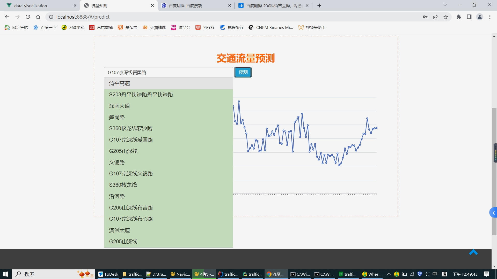
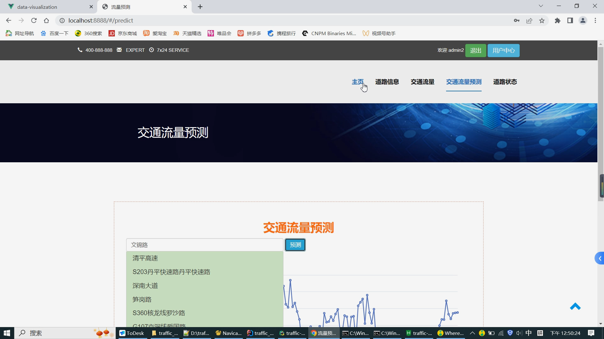

# 计算机毕业设计逆天版Python+Spark智慧城市交通大数据 交通流量预测 交通爬虫 地铁客流量分析 大数据毕业设计 大数据毕设 深度学习 机器学习

## 要求
### 源码有偿一套(论文 PPT 源码+sql脚本+虚拟机)
### 
### 加好友前帮忙start一下，并备注github有偿获取源码
### 我的QQ号是2877135669 或 1679232425

### 或者 微信 bysj2023nb

### 加qq好友说明（被部分  网友整得心力交瘁）：
    1.加好友务必按照格式备注git交通大数据最新
    2.避免浪费各自的时间

B站运行演示如下：

https://www.bilibili.com/video/BV1fR4y1B7EK/?spm_id_from=333.999.0.0

https://www.bilibili.com/video/BV1pd4y1n7Xa/?spm_id_from=333.999.0.0

# 多说几句：

吊炸天碾压导师绞杀导师让他无话答辩从头秒到尾

## 开发技术-粗略
Python爬虫、Python、MySQL、机器学习、Spark、Vue、echarts、springboot、短信、

Spark Hadoop 

# 开发技术-详细

前端：vue.js websocket echarts element-ui

后端：springboot+mybaits

大数据组件：Spark

机器学习/深度学习：线性回归预测、KNN、CNN等

数据库：mysql

爬虫：Python爬虫

三方接口：阿里云短信接口

## 创新点

预测算法

大屏

爬虫

前后端分离

## 补充说明
适合大数据毕业设计、数据分析、爬虫类计算机毕业设计

# 功能

1、门户系统

（1）道路车流量查询

（2）道路车流量预测

（3）道路状态信息发布

（4）查看道路状态信息

 

2、大屏统计系统

（1）道路车流量Top10

（2）道路累计车流量数据

（3）某一时段道路车流量数据

注：目前能想到的统计维度较少，后期是否能增加

 

3、后台管理系统

（1）个人信息管理

（2）用户管理

（3）道路信息管理

 

角色描述

4、用户角色

（1）系统中共有3个角色，分别是系统管理员，交通管理员和普通用户。

（2）系统管理员拥有最高权限，可以管理交通管理员和普通用户。

（3）交通管理员可以查询道路车流量、查看道路车流量预测结果、发布道路状态信息、查看道路状态信息，以及查看大屏统计系统。

（4）普通用户可以可以查询道路车流量，查看道路状态信息，以及查看大屏统计系统。

# 运行截图

# 演示视频

https://www.bilibili.com/video/BV1fR4y1B7EK/?spm_id_from=333.999.0.0

https://www.bilibili.com/video/BV1pd4y1n7Xa/?spm_id_from=333.999.0.0